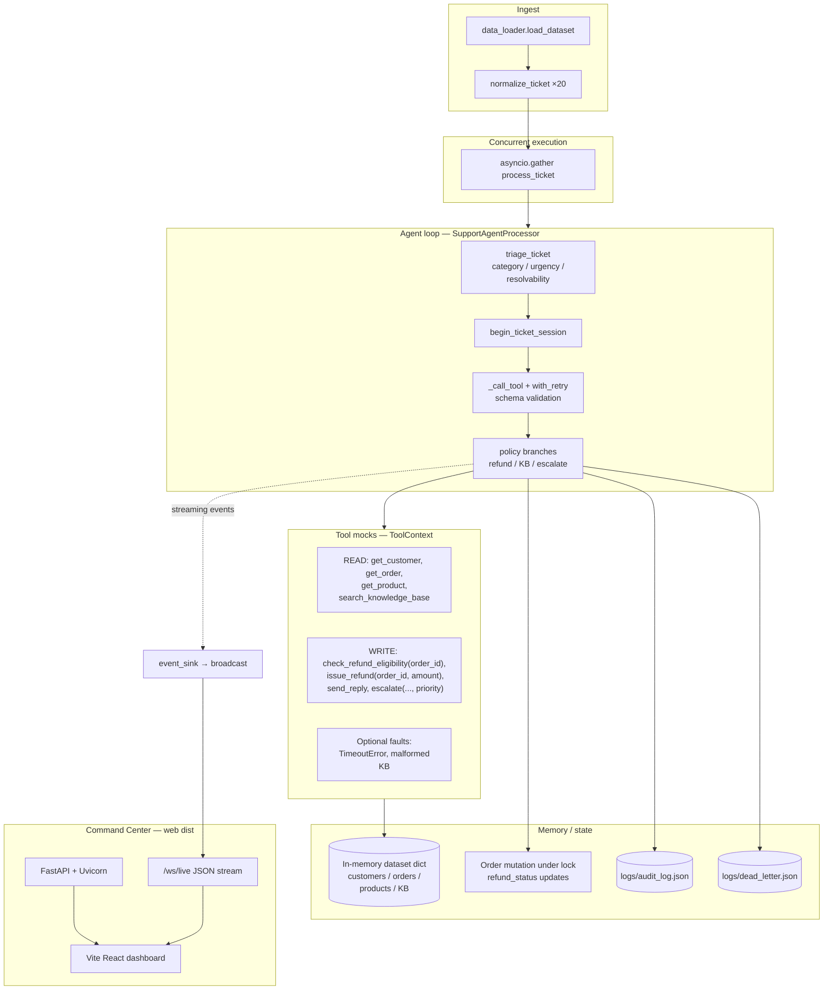

# Architecture — ShopWave Support Agent

One-page technical overview for submission: **agent loop**, **tools**, **state**.

## Diagram

## Command Center UI

The **FastAPI** app (`api/server.py`) serves the production **React** bundle under `web/dist`. During `POST /api/run`, `run_batch` emits structured events (`ticket_begin`, `tool_step`, `ticket_complete`, …) through an async callback to **WebSocket** subscribers — no polling, live concurrency-visible traces.

## Agent loop

For each ticket, the processor runs a **mostly deterministic** pipeline: **rule-based triage** (always), optional **LLM-assisted triage** (`llm_triage` audit step when `SHOPWAVE_USE_LLM_TRIAGE` + OpenAI or Ollama is configured) → session → lookups → eligibility / refund / reply or escalate. Refunds and writes do **not** use an LLM. Every tool invocation goes through `_call_tool`, which records an **AuditStep** (`thought`, tool name, attempt count, serialized result, status).

## Tool design

Mocks mirror the hackathon PDF: lookups return JSON-shaped dicts or `None`; writes mutate order refund state idempotently where applicable. **Schema validation** (`_validate_tool_output`) gates success before the agent trusts a response.

## Memory / state

- **Ephemeral**: loaded JSON dataset in `ToolContext`; no cross-run database.
- **Durability**: **audit** JSON and **dead-letter** JSON after each batch run.
